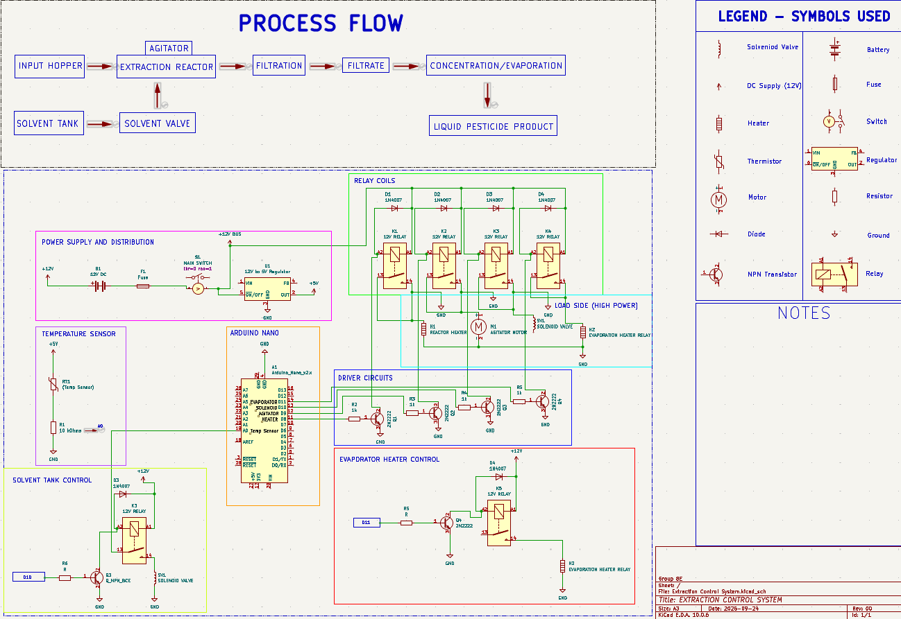

# 🔥 Extraction Control System

A hardware control system designed and documented using **KiCad**, featuring a control circuit for managing an extraction/heating-related system.

## 📸 Preview

## 📌 Project Overview

The **Extraction Control System** is an embedded/electronics project focused on designing a control circuit using electronic components and a relay-based switching mechanism.

The project schematic was developed and documented using **KiCad**, including the electrical connections between the control components and the load.

## 🛠️ Tools & Technologies

* KiCad
* Electronic Circuit Design
* Schematic Design
* PCB Design
* Relay Control
* Transistor Switching
* Basic Embedded Systems

## 📂 Project Files

| File         | Description                   |
| ------------ | ----------------------------- |
| `.kicad_pro` | KiCad project configuration   |
| `.kicad_sch` | Complete electrical schematic |
| `.kicad_pcb` | PCB layout/design             |

## ⚙️ Key Components

The design includes electronic control and switching components such as:

* 2N2222 transistor
* Relay
* Heater/load control
* Control and power connections
* Supporting electronic components

## 🎯 Project Purpose

This project demonstrates practical experience in:

* Electronic circuit design
* Reading and creating schematics
* Relay-based control systems
* PCB design
* Hardware troubleshooting
* Using KiCad for engineering documentation

## 📚 Skills Demonstrated

**Hardware & Electronics**

* Circuit design
* Component identification
* Transistor switching
* Relay control
* Hardware troubleshooting

**Engineering Tools**

* KiCad
* Schematic capture
* PCB layout

## 📌 Project Status

**Completed / Academic Project**

This project was developed as part of my Computer Engineering studies.

## 👨‍💻 Developer

**Kenneth James Valdez**

4th Year Computer Engineering Student
